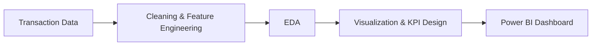

#  Supermarket Sales Analysis
This project focuses on predicting daily sales for a supermarket based on historical sales data, store information, and promotional activities. By applying machine learning models, it identifies patterns and key factors influencing sales, helping the supermarket optimize inventory, plan promotions effectively, and maximize revenue.

##  Business Problem
Supermarkets need to understand which factors drive sales and profitability across branches.  
The management wants to identify customer purchasing behavior, product performance, and payment trends.

**Goal:** Analyze supermarket transactional data to extract business insights and recommend strategies for revenue improvement.

##  Business Objectives
1. Understand sales trends by product, branch, and customer type.  
2. Identify high-performing branches and products.  
3. Visualize KPIs to support managerial decisions.

##  Data Cleaning
- Handled missing and duplicate invoice IDs.  
- Converted `Date` to datetime format.  
- Created derived columns: `Revenue`, `Average Rating`, and `Total Tax`.  
- Aggregated data by branch and product line.

##  Workflow

## Power BI Dashboard Highlights

- Total revenue by city and branch

- Top-selling product lines

- Payment method analysis

- Gender-based average spending comparison

- Monthly revenue and rating trends
  

## Business Insights

- Branch B generates highest revenue but lower customer satisfaction.

- Electronic payments dominate urban branches.

- Fashion accessories and food & beverages drive majority of sales.

- Customer ratings correlate positively with total amount spent.

## Tech Stack

Power BI | Excel | Python (for preprocessing)

## Business Analytics Extension

- Funnel analysis from product view → payment completion.

- Cohort analysis by customer month.

- KPI cards for revenue, gross margin, and satisfaction index.

## Conclusion

This project delivers data-driven insights to help supermarket management optimize pricing, promotions, and product planning.
